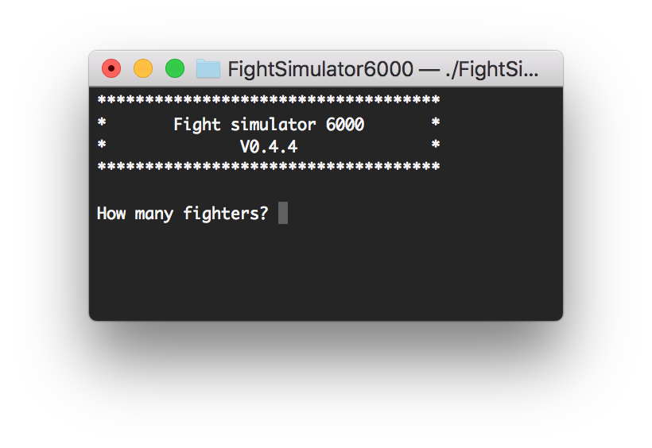
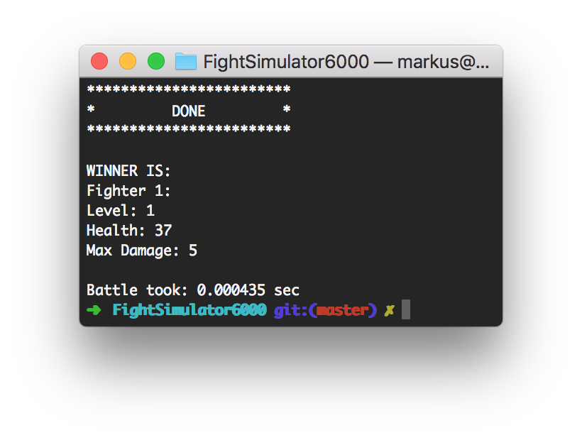

# Fight simulator 6000
<h2 align=center>Start</h2>



<h2 align=center>End</h2>


# Build
### Dependencies:
- CMake
- Visual Studio (Windows)
- g++ (Linux)

### Compile
- Clone project
- Run CMake
- Build

#### On Linux
```bash
git clone https://gitlab.com/Jylhis/FightSimulator6000.git &&
cd fightsimulator6000 &&
cmake . &&
make
```
